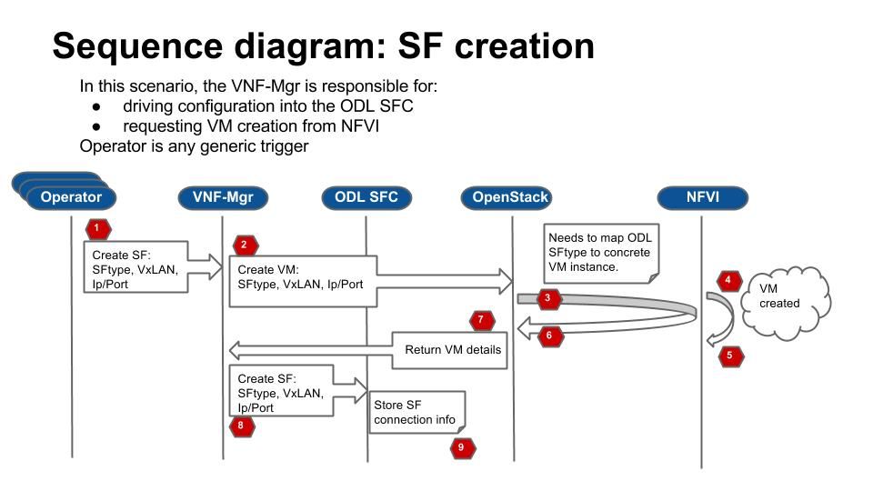
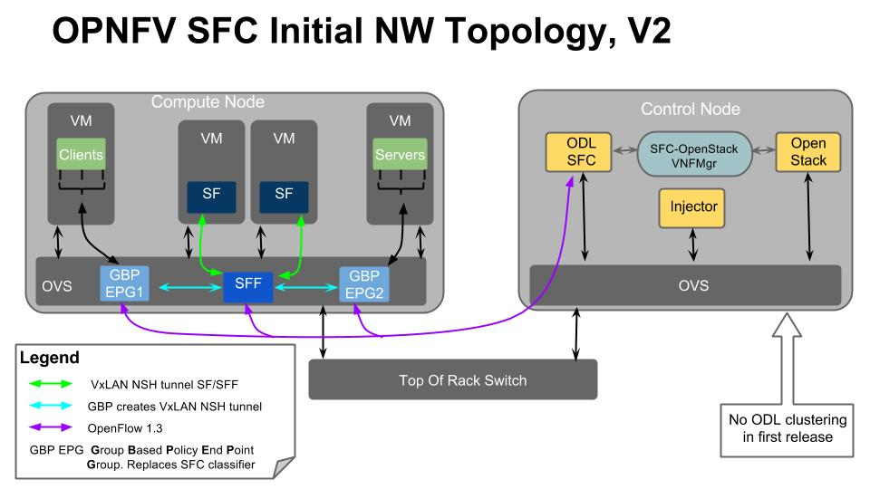
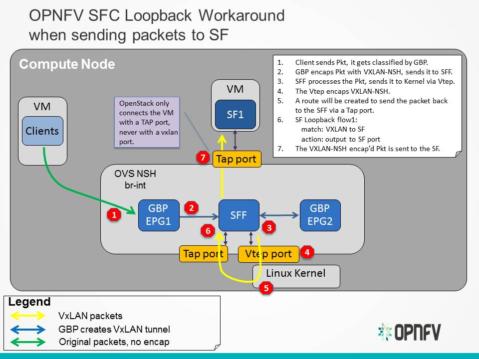
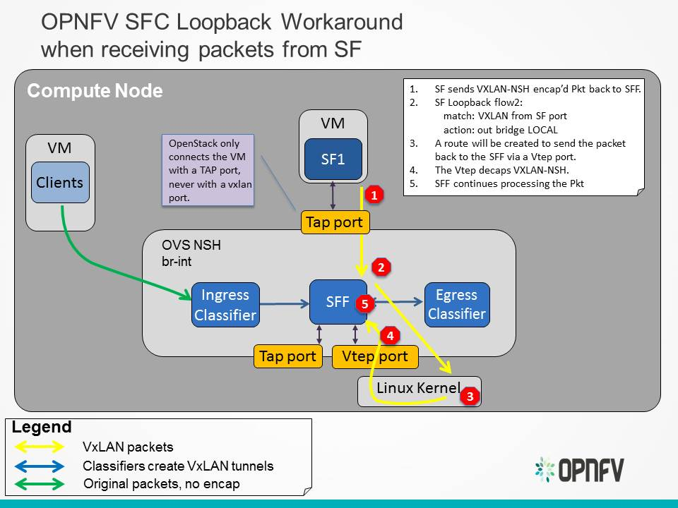

Architecture
------------

This section describes the architectural approach to incorporating the upstream
OpenDaylight (ODL) SFC project into the OPNFV Brahmaputra platform.

Service Functions
+++++++++++++++++

A Service Function (SF) is a Function that provides services to flows traversing
a Service Chain. Examples of typical SFs include: Firewall, NAT, QoS, and DPI.
In the context of OPNFV, the SF will be a Virtual Network Function. The SFs
receive data packets from a Service Function Forwarder.

Service Function Forwarders
+++++++++++++++++++++++++++

The Service Function Forwarder (SFF) is the core element used in Service
Chaining. It is an OpenFlow switch that, in the context of OPNFV, is hosted
in an OVS bridge. In OPNFV there will be one SFF per Compute Node that will
be hosted in the "br-int" OpenStack OVS bridge.

The responsibility of the SFF is to steer incoming packets to the corresponding
Service Function, or to the SFF in the next compute node. The flows in the SFF
are programmed by the OpenDaylight SFC SDN Controller.

Service Chains
++++++++++++++

Service Chains are defined in the OpenDaylight SFC Controller using the
following constructs:

SFC
  A Service Function Chain (SFC) is an ordered list of abstract SF types.

SFP
  A Service Function Path (SFP) references an SFC, and optionally provides
  concrete information about the SFC, like concrete SF instances. If SF
  instances are not supplied, then the RSP will choose them.

RSP
  A Rendered Service Path (RSP) is the actual Service Chain. An RSP references
  an SFP, and effectively merges the information from the SFP and SFC to create
  the Service Chain. If concrete SF details were not provided in the SFP, then
  SF selection algorithms are used to choose one. When the RSP is created, the
  OpenFlows will be programmed and written to the SFF(s).

Service Chaining Encapsulation
++++++++++++++++++++++++++++++

Service Chaining Encapsulation encapsulates traffic sent through the Service
Chaining domain to facilitate easier steering of packets through Service Chains.
If no Service Chaining Encapsulation is used, then packets much be classified
at every hop of the chain, which would be slow and would not scale well.

In ODL SFC, Network Service Headers (NSH) is used for Service Chaining
encapsulation. NSH is an IETF draft specification that uses 2 main header
fields to facilitate packet steering, namely:

NSP (NSH Path)
  The NSP is the Service Chain ID.

NSI (NSH Index)
  The NSI is the Hop in the Service Chain. The NSI starts at 255 and is
  decremented by every SF. If the NSI reaches 0, then the packet is dropped
  which avoids loop detections.

In ODL SFC, NSH packets are encapsulated in VXLAN-GPE.

Classifiers
+++++++++++

A classifier is the entry point into Service Chaining. The role of the
classifier is to map incoming traffic to Service Chains. In ODL SFC, this
mapping is performed by matching the packets and encapsulating the packets in
a VXLAN-GPE NSH tunnel.

The packet matching is specific to the classifier implementation, but can be
as simple as an ACL, or can be more complex by using PCRF information or DPI.

VNF Manager
+++++++++++

In OPNFV SFC, a VNF Manager is needed to spin-up VMs for Service Functions.
It has been decided to use the OpenStack Tacker VNF Mgr to spin-up and manage
the life cylcle of the SFs. Tacker will receive the ODL SFC configuration,
manage the SF VMs, and forward the configuration to ODL SFC. The following
sequence diagram details the interactions with the VNF Mgr:

OPNFV SFC Network Topology
++++++++++++++++++++++++++

The following image details the Network Topology used in OPNFV Brahmaputra SFC:

OVS NSH patch workaround
++++++++++++++++++++++++

When using NSH with VXLAN tunnels, its important that the VXLAN tunnel is
terminated in the SF VM. This allows the SF to see the NSH header, allowing
it to decrement the NSI and also to use the NSH metadata. When using VXLAN with
OpenStack, the tunnels are not terminated in the VM, but in the "br-int" OVS
bridge. There is work ongoing in the upstream OVS community to implemement NSH
encapsulation. To get around the way OpenStack handles VXLAN tunnels, the OVS
work will also include the ability to encapsulate/decapsulate VXLAN tunnels from
OpenFlow rules, instead of relying on the Vtep ports. The ongoing upstream OVS
work will probably not be finished by the time OPNFV Brahmaputra is released, so
a work-around has been created. This work-around will use a private branch of
OVS that has a preliminary version of NSH implemented.

The following diagram illustrates how packets will be sent to an SF, when the
SFF has processed the packet and wants to send it to the SF:

The following diagram illustrates how packets will sent from an SF to an SFF,
once the SF has processed a packet:

