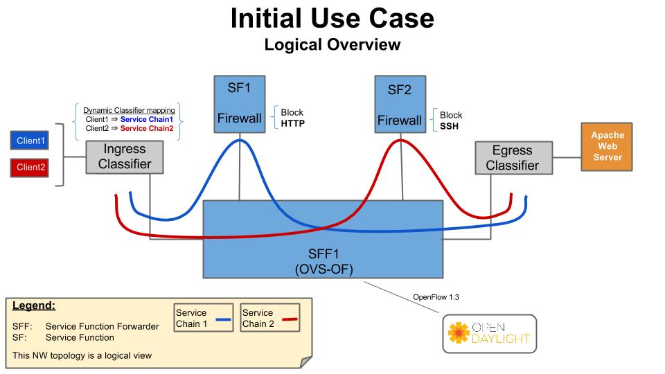

.. This work is licensed under a Creative Commons Attribution 4.0 International License.
.. http://creativecommons.org/licenses/by/4.0

Use Cases
---------

This section outlines the Colorado use cases driving the initial OPNFV
SFC implementation.

The use cases targeted in the OPNFV SFC Colorado release focus on creating
simple Service Chains using Firewall Service Functions. As can be seen in the
following diagram, 2 service chains are created, each through a different
Service Function Firewall. Service Chain 1 will block HTTP, while Service
Chain 2 will block SSH.

